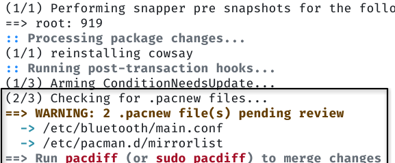

# Pacman pacdiff notify hook

A simple hook that helps the user by notifying them when pacnew files exist and
provides follow-up suggestions.

# Sample output

# Purpose

This hooks runs to give the user information *only*. The user can perform the
necessary actions, as printed in the output message of the hook.
